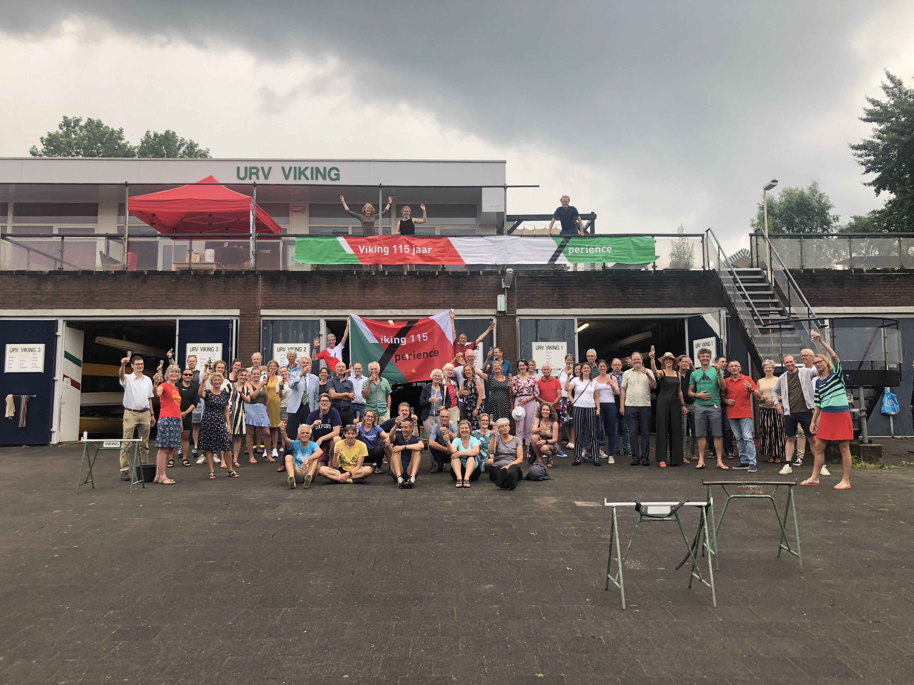
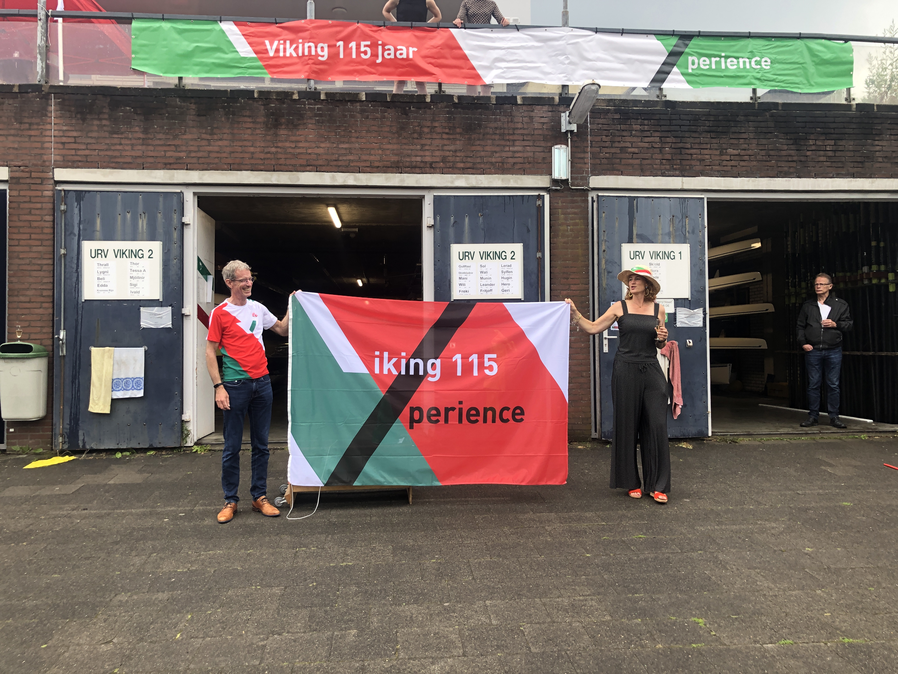

## Suppen, 25 juli 2021

Zondag 25 jongstleden vond de opening van het lustrumjaar plaats met een fantastische stand-up-paddle experience en een borrel met zomerse bubbelwijnen! Twee Vikingers haalden een nat pak bij het suppen. De rest van de Vikingers haalde een nat pak door de daaropvolgende wolbreuk. Maar Vikingers waren niet voor één gat gevangen natuurlijk! De wijn vond gretig aftrek, vooral de alcohol~~vrije~~ -houdende wijn! Klik op de foto's hieronder voor een grotere versie.

