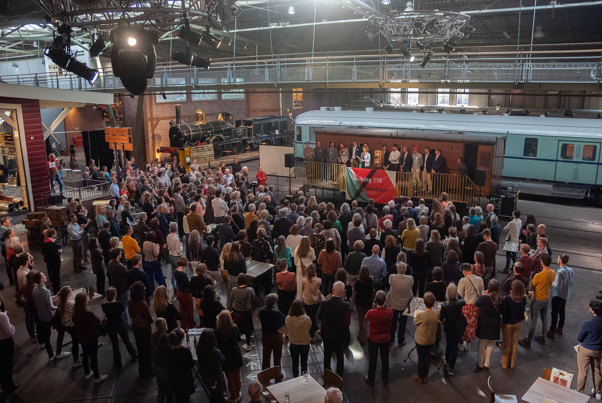

## Foto's
[Lustrumfeest](https://vikinglustrum.nl/fotos/#lustrumfeest-2-april-2022)

[Coastal roeien](https://vikinglustrum.nl/fotos/#coastal-roeien-9-october-2021) 

[Oudledendag](https://vikinglustrum.nl/fotos/#oudledendag-4-september-2021)

[Drakenbootvaren](https://vikinglustrum.nl/fotos/#drakenbootvaren-28-augustus-2021)

[de opening van het lustrumjaar](https://vikinglustrum.nl/fotos/#suppen-25-juli-2021)

## Lustrumfeest, 2 april 2022

Op 2 april kwamen in het spoorwegmuseum bootladingen met Vikingers feestvieren! Na de afgelasting duurde even voordat het lustrumfeest doorgang kon vinden, maar het was des te spetterender. Prijsuitreikingen, Vikingliederen, teamfoto's in nautische outfits, huldigingen, lekker eten en drinken, een feestband die los ging! Het was memorabel!

## Coastal roeien, 9 october 2021

Volgens de 16 dappere Vikingers die zich aan het 'coastal rowing' waagden waren de golven op het Ijsselmeer nogal wat hoger dan die op de Vecht! Het was genieten geblazen voor deze delegatie van Viking. Dank aan de KNZRV in Muiden voor het ontvangst en de instructie!

## Oudledendag, 4 september 2021

Het weer was prachtig, de opkomst hoog, het eten lekker, en het terras gezellig! Dank aan alle bezoekers en vrijwiligers voor een geslaagd evenement. Voor herhaling vatbaar! Voor meer foto's en informatie over de oudledengroep van Viking, ga naar de [facebookgroep](https://www.facebook.com/groups/1443347109235746).

## Drakenbootvaren, 28 augustus 2021

Enkele dappere Vikingers waagden zich aan drakenbootvaren in Montfoort, afgelopen zaterdag! Na een hartelijk ontvangst door de Montfoort Dragons ontvingen de roeiers instructie. Toen kozen ze het ruime sop, onder begeleiding van een drumster en een stuurman.

## Suppen, 25 juli 2021

Zondag 25 juli j.l. vond de opening van het lustrumjaar plaats met een fantastische <em>stand-up-paddle experience</em> en een borrel met zomerse bubbelwijnen! Twee Vikingers haalden een nat pak bij het suppen. De rest haalde een nat pak bij de daaropvolgende wolkbreuk. De bubbels vonden gretig aftrek, vooral de alcohol~~vrije~~ -houdende wijnen deden het goed! 

Klik op de foto's hieronder om grotere versies te zien (bedankt Tessa, voor het maken van de foto's!)

