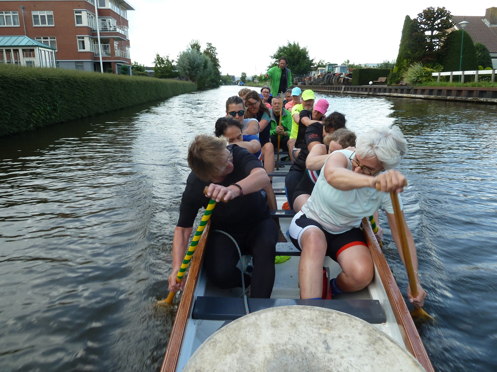

## Programma oudledendag

Ondertussen is het programma voor de oudledendag van 4 september aanstaande bekend gemaakt.  Opgeven is helaas niet meer mogelijk. Het programma ziet er als volgt uit:

| 11.00 uur | rondje Singel door een aantal oud-leden |
| 13.30 uur | inloop gasten |
| 14.00 uur | opening en aansluitend botendoop |
| 15.00 uur | varen dubbelacht |
| 17.30 uur | buffet |

Daarnaast is er ook nog een fotoshow over 115 jaar Viking en een demonstratie van oude boten. Net als jullie zien we erg uit naar dit evenement! Voor meer informatie, ga naar de [facebookgroep](https://www.facebook.com/groups/1443347109235746) voor de oudledendag. 

## Foto's drakenboot varen

Check deze gave actiefoto, genomen voor Vikingers die in Montfoort gingen drakenbootvaren! Lees de komende Viking Nieuws voor een uitgebreid verslag.



## Foto's opening lustrumjaar

Neem een kijkje bij de foto's van [de opening van het lustrumjaar] (https://vikinglustrum.nl/fotos/) dat plaatsvond op 25 juli.

## In een drakenboot varen

Sluit je vakantie af met drakenboot varen in Montfoort op 28 augustus! Drakenboten zijn open kano's waar je met zijn twintigen in zit. Je peddelt twee aan twee, terwijl een drummer het ritme van de slag aangeeft. Dit wordt een _experience_ die je niet snel zult vergeten. We gaan dit doen in het mooie dorpje Montfoort (op fietsafstand, dus).  We beginnen om 10 uur 's ochtends. Geef je op via [e-captain](https://viking-site.e-captain.nl/)!


## Suppen

De opening van de 115de Dies Natalis van URV Viking zal op 25 juli worden gevierd met een borrel en een speciale _experience_, namelijk stand-up paddleboarding!
Lijkt het je leuk om eens te 'suppen' op het Merwedekanaal? We hebben ervaren paddleboardinstructeurs ingeschakeld om de sup-vaardigheden van Vikingers wat bij te spijkeren.

Geef je op voor een middag sup-instructie, onder het genot van een drankje. Het suppen begint om 15:00 uur ’s middags en de borrel om 16:30.

Opgeven kan via [e-captain](https://viking-site.e-captain.nl/). Laat ons weten of je komt suppen, of borrelen, of allebei. 


## Roeikleding

De speciale lustrumroeikleding is ondertussen te bestellen bij Roeigoed. Klik op de Roeipak-link hierboven om te zien hoe je kunt bestellen. Hoe deze kleding eruitziet? Bekijk deze video voor een voorproefje:

<video width="100%" controls playsinline>
      <source src="fieke-roeipak.mp4" type="video/mp4">
	  <source src="fieke-roeipak.m4v" type="video/m4v">
      <p>Your browser does not support the video element.</p>
</video>

## Welkom!

Welkom op de lustrumwebsite van URV Viking! Hier vindt u informatie over speciale happenings die plaats zullen vinden in dit speciale jubileumjaar, 2021. URV Viking bestaat op 27 juli maar liefst honderdvijftien jaar! Dat verdient een pluim en daarom pakken we vanaf 25 juli groots uit!

Stay tuned!

<!--

## Welcome to GitHub Pages

You can use the [editor on GitHub](https://github.com/brandtvandergaast/vikinglustrum/edit/gh-pages/index.md) to maintain and preview the content for your website in Markdown files.

Whenever you commit to this repository, GitHub Pages will run [Jekyll](https://jekyllrb.com/) to rebuild the pages in your site, from the content in your Markdown files.

## 

Hier test ik even linkjes:
[roeipak](https://vikinglustrum.nl/roeipak/)
[kalender](https://vikinglustrum.nl/kalender/)
[over het lustrum](https://vikinglustrum.nl/over-het-lustrum/)

### Markdown

Markdown is a lightweight and easy-to-use syntax for styling your writing. It includes conventions for

```markdown
Syntax highlighted code block

# Header 1
## Header 2
### Header 3

- Bulleted
- List

1. Numbered
2. List

**Bold** and _Italic_ and `Code` text

[Link](url) and 
```

For more details see [GitHub Flavored Markdown](https://guides.github.com/features/mastering-markdown/).

### Jekyll Themes

Your Pages site will use the layout and styles from the Jekyll theme you have selected in your [repository settings](https://github.com/brandtvandergaast/vikinglustrum/settings). The name of this theme is saved in the Jekyll `_config.yml` configuration file.

### Support or Contact

Having trouble with Pages? Check out our [documentation](https://docs.github.com/categories/github-pages-basics/) or [contact support](https://support.github.com/contact) and we’ll help you sort it out.

-->


