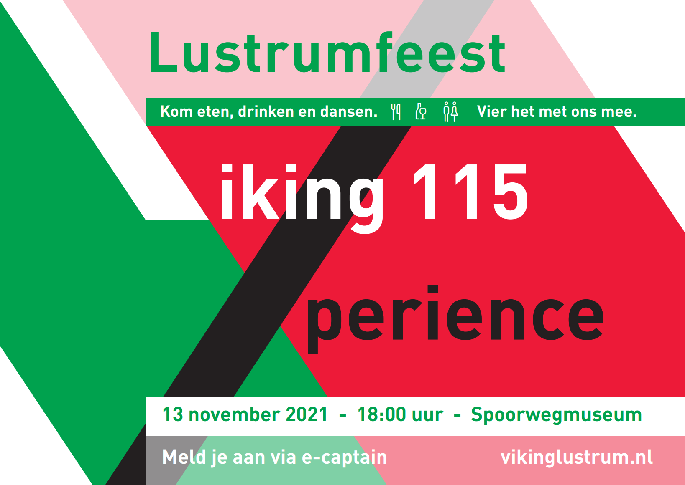
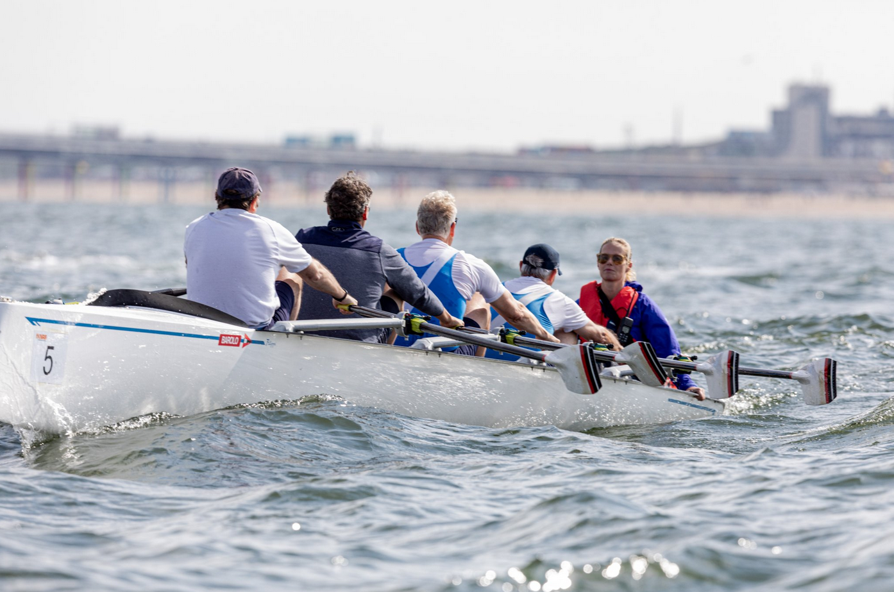

## Welkom bij 115 jaar Viking!

Neem een kijkje op deze site voor alle feestelijkheden in het kader van het 115de jaar van URV Viking! 

## Lustrumfeest!

Save the date! Schrijf 13 november alvast maar in je agenda, want er staat een feest van jawelste aan te komen! 



## [VOL!] Coastal roeien [VOL!]

Benieuwd hoe het is om te roeien op water met wat golven? Wil je wel eens wat anders dan het spiegelvlakke Merwedekanaal? Geef je dan op voor coastal roeien in Muiden. Dit gebeurt op 9 oktober en we verzamelen om 15:00 uur bij de KNZRV in Muiden. Na afloop kan er op locatie geborreld en gegeten worden. Schrijf je in via e-captain (er zijn geen kosten aan verbonden).



## Foto's oudledendag 

Klik [hier](https://vikinglustrum.nl/fotos/#oudledendag-4-september-2021) voor een korte beschrijving van de zeer geslaagde oudledendag van 4 september! 

## Foto's drakenboot varen

Klik [hier](https://vikinglustrum.nl/fotos/#drakenbootvaren-28-augustus-2021) om de foto's van het drakenbootvaren op 28 augustus te zien!


## Foto's opening lustrumjaar

Neem een kijkje bij de foto's van [de opening van het lustrumjaar](https://vikinglustrum.nl/fotos/#suppen-25-juli-2021) dat plaatsvond op 25 juli.

## Roeikleding

De speciale lustrumroeikleding is ondertussen te bestellen bij Roeigoed. Klik op de Roeipak-link hierboven om te zien hoe je kunt bestellen. Hoe deze kleding eruitziet? Bekijk deze video voor een voorproefje:

<video width="100%" controls playsinline>
      <source src="fieke-roeipak.mp4" type="video/mp4">
	  <source src="fieke-roeipak.m4v" type="video/m4v">
      <p>Your browser does not support the video element.</p>
</video>

## Welkom!

Welkom op de lustrumwebsite van URV Viking! Hier vindt je informatie over speciale happenings die plaats zullen vinden in dit speciale jubileumjaar, 2021. URV Viking bestaat op 27 juli maar liefst honderdvijftien jaar! Dat verdient een pluim en daarom pakken we vanaf 25 juli groots uit!

Stay tuned!

<!--

## Welcome to GitHub Pages

You can use the [editor on GitHub](https://github.com/brandtvandergaast/vikinglustrum/edit/gh-pages/index.md) to maintain and preview the content for your website in Markdown files.

Whenever you commit to this repository, GitHub Pages will run [Jekyll](https://jekyllrb.com/) to rebuild the pages in your site, from the content in your Markdown files.

## 

Hier test ik even linkjes:
[roeipak](https://vikinglustrum.nl/roeipak/)
[kalender](https://vikinglustrum.nl/kalender/)
[over het lustrum](https://vikinglustrum.nl/over-het-lustrum/)

### Markdown

Markdown is a lightweight and easy-to-use syntax for styling your writing. It includes conventions for

```markdown
Syntax highlighted code block

# Header 1
## Header 2
### Header 3

- Bulleted
- List

1. Numbered
2. List

**Bold** and _Italic_ and `Code` text

[Link](url) and 
```

For more details see [GitHub Flavored Markdown](https://guides.github.com/features/mastering-markdown/).

### Jekyll Themes

Your Pages site will use the layout and styles from the Jekyll theme you have selected in your [repository settings](https://github.com/brandtvandergaast/vikinglustrum/settings). The name of this theme is saved in the Jekyll `_config.yml` configuration file.

### Support or Contact

Having trouble with Pages? Check out our [documentation](https://docs.github.com/categories/github-pages-basics/) or [contact support](https://support.github.com/contact) and we’ll help you sort it out.

-->


