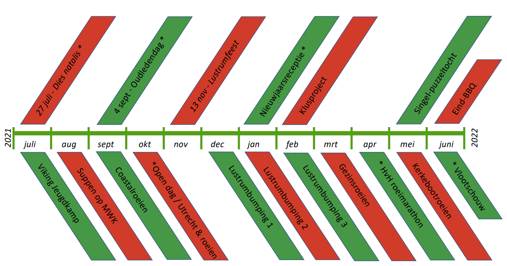

## Kalender

Vanaf 27 juli 2021 barst het Viking lustrumjaar los! Verwacht een jaar tjokvol met feesten, wedstrijden, evenementen, reünies, tochten, en andere bezigheden in en op het water. Zie hieronder de voorlopige concept-kalender. Wijzigingen voorbehouden!

| Maand | Activiteiten |
| --------------- | --------------- | -------------- |
| Juli | Dies Natalis | Viking jeugdkamp |
| Augustus | Suppen op Merwedekanaal | |
| September | Coastal roeien | 4 Sept: Oudledendag |
| October | Open dag/Utrecht & roeien | |
| November | Lustrumfeest (13 nov) | |
| December | Lustrumbumping 1 | | 
| Januari | Lustrumbumping 2 | Nieuwjaarsreceptie |
| Februari | Lustrumbumping 3 | |
| Maart | Gezinsroeien | |
| April | Hart van Holland roeimarathon | |
| Mei | Kerkebootroeien | Singel-puzzeltocht |
| Juni | Eind-BBQ | Vlootschouw | 

