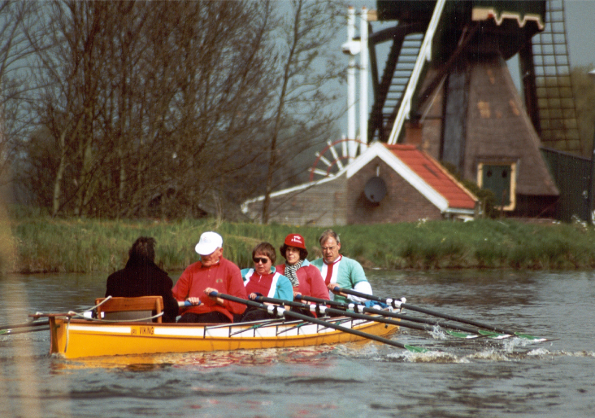

## 115 jaar Viking!

Al 115 jaar lang komen roeiers in Utrecht samen bij URV Viking om te genieten van de roeisport. Om elkaar in de roeiboot uit te dagen, maar ook om teams te vormen. Om hard te werken, en om daarna op het terras te genieten. Om herinneringen te maken en ervaringen op te doen. Het them van Viking's lustrumjaar is daarom ook: _experience_. Wij hopen de leden van Viking bijzondere ervaringen aan te bieden, op sportief, culinair, sociaal, en creatief terrein!  

Dus zet je schrap voor dit bijzondere jubileumjaar dat begint op 27 juli 2021! 

 