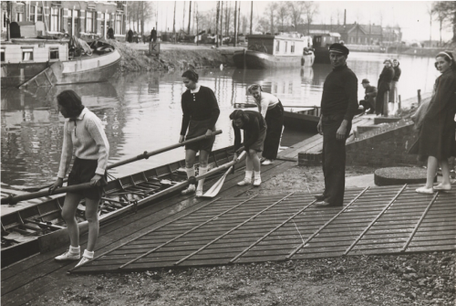

## 115 jaar Viking!

Al 115 jaar lang komen roeiers in Utrecht samen bij URV Viking om te genieten van de roeisport. Om elkaar in de roeiboot uit te dagen en om met elkaar tegen andere teams te strijden. Om meters te maken op het water en om daarna op het terras te genieten. Om herinneringen te maken en ervaringen op te doen. Het thema van Viking’s 115-jarige jubileum is daarom ook: experience. Wij hopen de leden van Viking bijzondere ervaringen aan te bieden, op sportief, sociaal en culinair gebied!

Dus zet je schrap voor dit bijzondere jubileumjaar dat begint op 25 juli 2021!
 
 